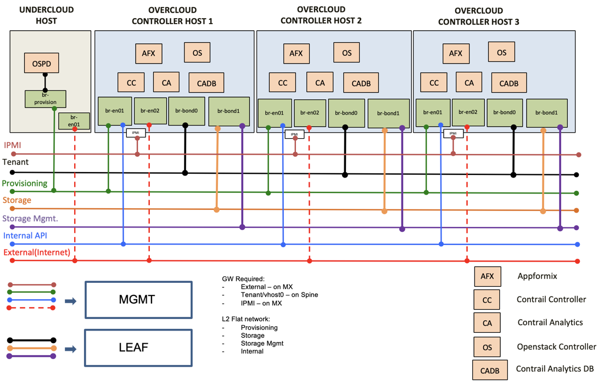

# Contrail Cloud Overview 
----------------------------
Juniper Networks Contrail Cloud is an integrated Telco Cloud platform built to run high-performance NFV with always-on reliability, allowing service providers to deliver innovative services with greater agility. Contrail Cloud Release 13.1 features Red Hat OpenStack combined with Juniper Contrail Networking, thereby bridging dynamic cloud orchestration with highly scalable connectivity. Furthermore, Contrail Cloud leverages AppFormix which has a built-in automation capability powered by machine learning to run the cloud infrastructure and VNFs in the most optimal manner, and remediating any potential failures to ensure adherence to SLAs.

### CC Controllers Topology 
-----------------------------

